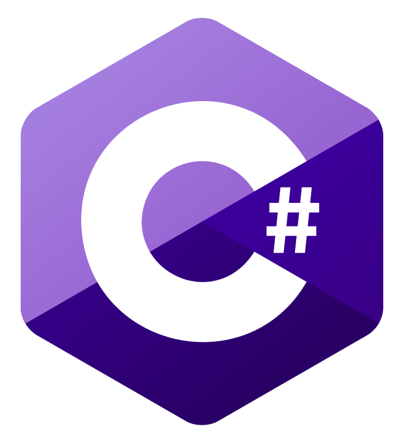

<h1 align="center">Hello! I'm Johan Vadenne</h1>

<h2 align="center">my passions 🔥</h2>

<h3 align="center">IT 💻</h3>
<h3 align="center">web development 🌐</h3>
<h3 align="center">software development 👨‍💻</h3>
<h3 align="center">cyber security 🔒</h3>
<h3 align="center">video game 🎮</h3>

 
<h2 align="center">Languages 📖</h2>
<table align="center">
        <tr>
            <th>Skill</th>
            <th>Level</th>
        </tr>
        <tr>
            <td></td>
            <td></td>
        </tr>
        <tr>
            <td></td>
            <td></td>
        </tr>
        <tr>
            <td></td>
            <td></td>
        </tr>
        <tr>
            <td></td>
            <td></td>
        </tr>
        <tr>
            <td></td>
            <td></td>
        </tr>
        <tr>
            <td></td>
            <td></td>
        </tr>
        <tr>
            <td></td>
            <td></td>
        </tr>
        <tr>
            <td></td>
            <td></td>
        </tr>
        <tr>
            <td></td>
            <td></td>
        </tr>
    </tbody>
</table>
<h2 align="center">System 📀</h2>
<table align="center">
        <tr>
            <th>System</th>
            <th>Level</th>
        </tr>
        <tr>
            <td></td>
            <td></td>
        </tr>
        <tr>
            <td></td>
            <td></td>
        </tr>
</table>

<table align="center">
  <tr>
    <th>software</th>
    <th>Level</th>
  </tr>
  <tr>
    <td></td>
    <td></td>
  </tr>
  <tr>
    <td></td>
    <td></td>
  </tr>
  <tr>
    <td></td>
    <td></td>
  </tr>
  <tr>
    <td></td>
    <td></td>
  </tr>
  <tr>
    <td></td>
    <td></td>
  </tr>
  <tr>
    <td></td>
    <td></td>
  </tr>
  <tr>
    <td></td>
    <td></td>
  </tr>
</table>
 
<h1 align="center">Personal projects 🔨</h1>
<h2 align="center"><a href="https://github.com/johanvadenne/INFINITY-FLOORS.git">INFINITY FLOORS</a></h2>
 
<h1 align="center">Projets professionnel 👔</h1>
<h2 align="center"><a href="https://github.com/johanvadenne/les-frelots.git">Les Frelots</a>: <a href="https://lesfrelots.fr">lesfrelots.fr</a></h2>
 
<h1 align="center">programs</h1>
<h2 align="center"><a href="https://github.com/johanvadenne/site-creer.git">website</a></h2>
<h2 align="center"><a href="https://github.com/johanvadenne/python.git">PYTHON</a></h2>
<h2 align="center"><a href="https://github.com/johanvadenne/php.git">PHP</a></h2>
<h2 align="center"><a href="https://github.com/johanvadenne/csharp.git">C#</a></h2>
<h2 align="center"><a href="https://github.com/johanvadenne/HTML-CSS-JS.git">HTML/CSS/JS</a></h2>
 
<h1 align="center">cyber-security</h1>
<h2 align="center"><a href="https://github.com/johanvadenne/Cyber-securite.git">malicious program</a></h2>